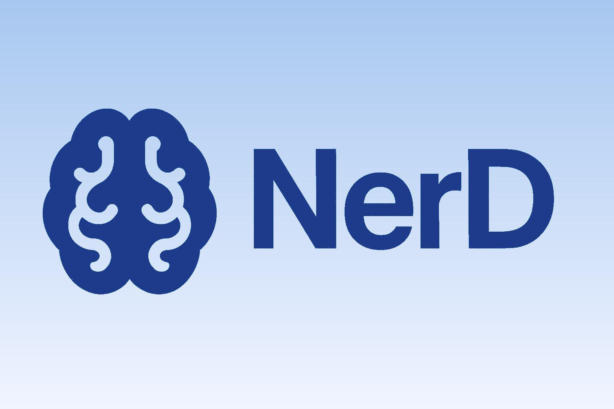

# NerD 🧠📸

**NerD** is a multitask natural language processing system that performs **Named Entity Recognition (NER)** and **Sentiment Analysis (SA)** simultaneously, enriched by **Image Captioning**. Designed to process and analyze multimodal content (text + image), NerD extracts structured information and sentiment context from real-world data, such as news or social media posts.

This project was developed as part of a **Deep Learning and NLP** course at the **Universidad Pontificia Comillas, ICAI**, within the **Engineering Mathematics** program.

## 📜 Table of Contents
- [📌 Project Overview](#-project-overview)
- [🛠️ Installation](#️-installation)
- [🚀 How to Use](#-how-to-use)
- [📂 Project Structure](#-project-structure)
- [🧠 Technologies Used](#-technologies-used)
- [🙌 Credits](#-credits)

## 📌 Project Overview

NerD combines multiple deep learning components to perform robust analysis of multimodal data:

### 🔁 Multitask Learning Model
- A custom **BiLSTMTagger** model performs both:
  - **Token-level Named Entity Recognition (NER)**
  - **Sentence-level Sentiment Analysis (SA)**
- Shared **BiLSTM encoder** for feature extraction.
- Optimized using a combination of `CrossEntropyLoss` for NER and `BCELoss` for SA.
- Model selection based on validation performance.

### 🖼️ Image Captioning Integration
- A pretrained model from **Hugging Face** generates captions from input images.
- These captions are incorporated into the input pipeline to enhance entity and sentiment prediction.

### 📊 Dataset Curation
- Reformatted and preprocessed **MultiNERD** and other datasets.
- Auto-labeled sentiment using a pretrained model.
- Balanced dataset:
  - 40,000 training samples
  - 10,000 testing samples
  - Equal distribution of positive and negative sentiments

### ✅ Preliminary Results
- High NER performance on key entity types: `PERSON`, `ORG`, `LOC`
- SA achieves **84% validation accuracy**
- Alert generation pipeline is planned but not yet deployed

## 🛠️ Installation

### Prerequisites
- Python 3.8+
- Pretrained word2vec model (`GoogleNews-vectors-negative300`)
- Pretrained model weights (`best_model.pt` and `tag2idx.pkl` in the `models/` directory)

### Setup

1. Clone the repository:
   ```bash
   git clone https://github.com/your-username/NerD.git
   cd NerD
   ```
   
2. Create a virtual environment and activate it (optional but recommended):
   ```bash
   python -m venv venv
   .\venv\Scripts\activate   # On Windows
   source venv/bin/activate # On macOS/Linux
   ```

3. Install dependencies:
   ```bash
   pip install -r requirements.txt
   ```

4. Run the app:
   ```bash
   python app.py
   ```

## 🚀 How to Use

The system exposes a simple web-based interface:

1. Upload a text post (e.g., news or social media content).
2. Upload a related image.
3. Click the **Analyze** button.

The app will:

- Generate a caption for the image.
- Perform NER + SA on the text + image caption.
- Display extracted entities and sentiment.

⚠️ **Make sure the pretrained models are present in the `models/` folder before running the app.**

## 📂 Project Structure

```plaintext
NerD/
│
├── app.py                  # Entry point for the web interface
├── requirements.txt        # Python dependencies
├── README.md               # This file
│
├── data/                   # Datasets
│   ├── train.tsv, test.tsv
│   └── multinerd/, NLP_Data/, nsa/
│
├── models/                 # Pretrained models
│   ├── best_model.pt
│   ├── tag2idx.pkl
│   └── w2v_model.bin
│
├── images/                 # Project-related images
│   └── banner.jpg, logo.jpg
│
├── docs/                   # Project documents and reports
│
└── src/                    # Source code
    ├── data.py
    ├── embeddings.py
    ├── evaluate.py
    ├── image_captioning.py
    ├── main.py
    ├── models.py
    ├── train.py
    └── tsv_preprocessing.py
```


## 🧠 Technologies Used

### Frameworks & Libraries

- **PyTorch** – for building and training the BiLSTM multitask model  
- **Transformers** – Hugging Face library for image captioning  
- **Gensim** – for loading pretrained word embeddings  
- **Gradio** – for creating the interactive web interface  
- **Scikit-learn** – for evaluation metrics  

### NLP & ML Techniques

- **BiLSTM Encoder**  
- **Multitask Learning**  
- **NER with Sequence Tagging**  
- **Binary Sentiment Classification**  
- **Image-to-Text Captioning**

## 🙌 Credits

This project was developed as part of the **Deep Learning + NLP** course at **Universidad Pontificia Comillas, ICAI**.

### Team Members

- **Beltrán Sánchez Careaga**
- **Eugenio Ribón Novoa**
- **Jorge Kindelan Navarro**
- **Ignacio Queipo de Llano Pérez-Gascón**

### Special Thanks To

- **Jaime Pizarroso Gonzalo** and **Andrés Occhipinti Liberman**, our professors, for their guidance and support throughout the course.  
- **Hugging Face** and **Gensim** communities for providing powerful pretrained models and tools.  
- **Open Source Contributors** whose libraries made this project possible.


<<<<<<< HEAD
=======

>>>>>>> dda5e554d43d74cf799e88029ad799f29bcb3756
